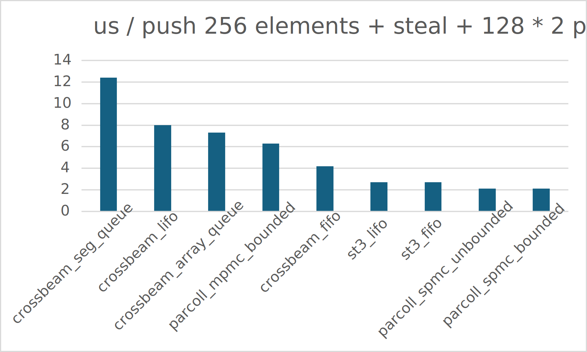

# Parcoll

This repository provides optimized collections which can be used in concurrent runtimes.

It provides optimized ring-based SPSC (const bounded or unbounded),
SPMC (const bounded or unbounded) and bounded MPMC queue.

All queues are lock-free (or lock-free with the proper generics), generalized and can be
either be cache-padded or not.

# Usage

```rust
use parcoll::{Consumer, Producer};

fn mpmc() {
    let (producer, consumer) = parcoll::mpmc::new_cache_padded_bounded::<_, 256>();
    let producer2 = producer.clone();
    let consumer2 = consumer.clone(); // You can clone the consumer
    
    producer.maybe_push(1).unwrap();
    producer.maybe_push(2).unwrap();
    
    let mut slice = [std::mem::MaybeUninit::uninit(); 3];
    let popped = consumer.pop_many(&mut slice);
    
    assert_eq!(popped, 2);
    assert_eq!(unsafe { slice[0].assume_init() }, 1);
    assert_eq!(unsafe { slice[1].assume_init() }, 2);
}

fn spsc_unbounded() {
    let (producer, consumer) = parcoll::spsc::new_cache_padded_unbounded();
    
    producer.maybe_push(1).unwrap();
    producer.maybe_push(2).unwrap();
    
    let mut slice = [std::mem::MaybeUninit::uninit(); 3];
    let popped = consumer.pop_many(&mut slice);
    
    assert_eq!(popped, 2);
    assert_eq!(unsafe { slice[0].assume_init() }, 1);
    assert_eq!(unsafe { slice[1].assume_init() }, 2);
}

fn spmc() {
    let (producer1, consumer1) = parcoll::spmc::new_bounded::<_, 256>();
    let (producer2, consumer2) = parcoll::spmc::new_bounded::<_, 256>();
    
    for i in 0..100 {
        producer1.maybe_push(i).unwrap();
    }
    
    consumer1.steal_into(&producer2);
    
    assert_eq!(producer2.len(), 50);
    assert_eq!(consumer1.len(), 50);
}
```

# Benchmarks

## Push + Pop (ns/op)


# Push * 256 + steal + Pop * 256 (us/op)



# Optimizations

All queues are optimized as much as possible (or we think so). It includes:

- cache-padding (not alignment);
- caching of atomics values where it makes sense;
- using as low CAS as possible.

If you have any idea how to make it even better, please let us know 
(create either issue or pull request).